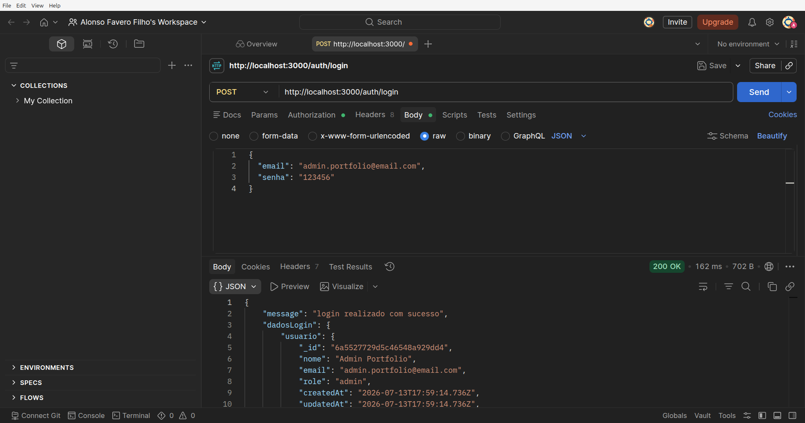
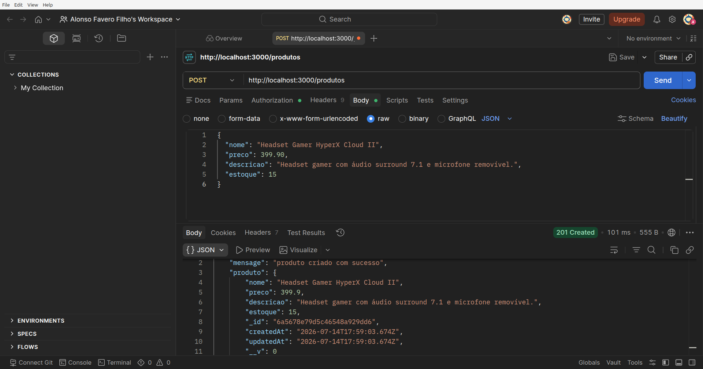
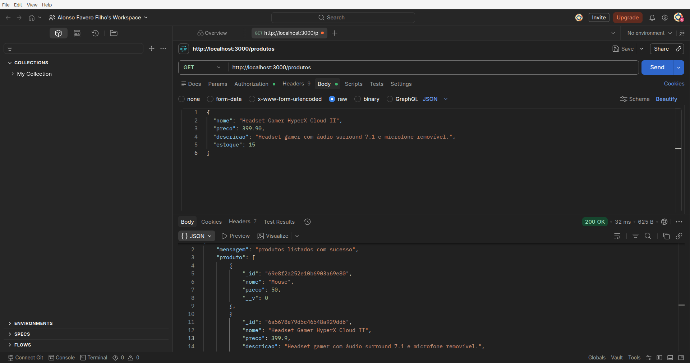
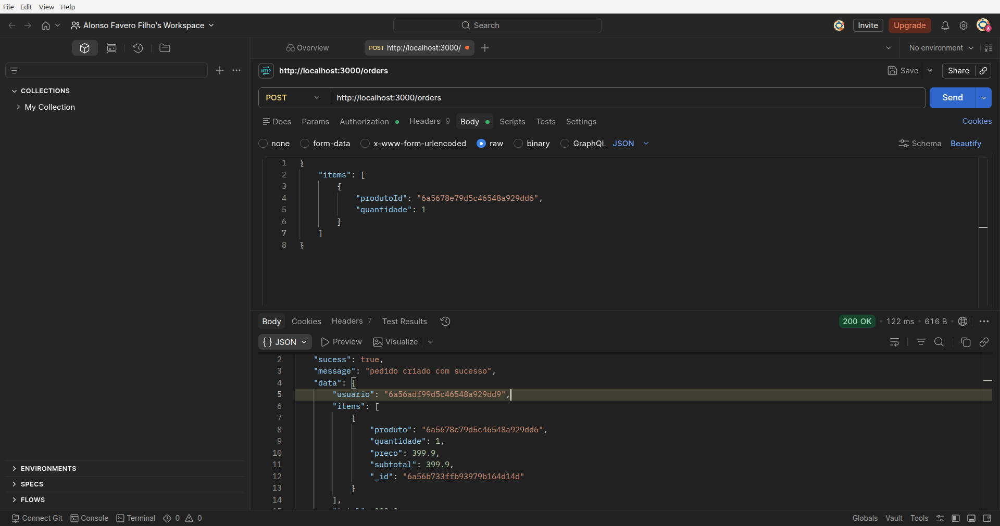
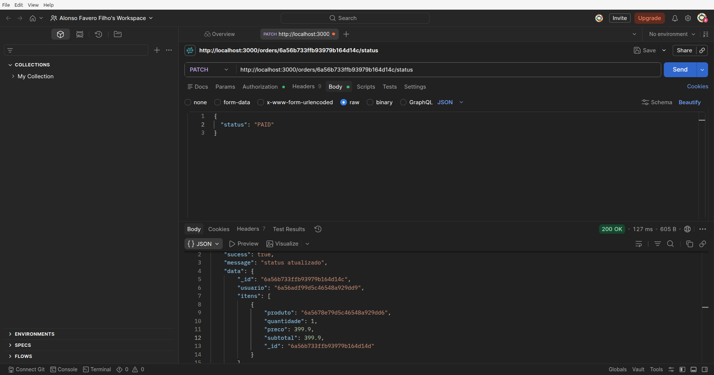

# 🛒 E-commerce API


> API REST desenvolvida com **Node.js**, **Express** e **MongoDB** para simular o backend de um sistema de e-commerce, utilizando autenticação JWT, controle de acesso por perfis e arquitetura em camadas.

**Status do Projeto:** Concluído

---

# 📸 Demonstração da API

Abaixo estão algumas das principais funcionalidades implementadas e testadas através do Postman.

### 🔐 Login



### 📦 Cadastro de Produto



### 📋 Lista de Produtos



### 🛒 Criação de Pedido



### 🚚 Atualização de Status



---

# 📚 Índice

* [Sobre o projeto](#-sobre-o-projeto)
* [Tecnologias utilizadas](#-tecnologias-utilizadas)
* [Arquitetura](#-arquitetura)
* [Diferenciais](#-diferenciais)
* [Funcionalidades](#-funcionalidades)
* [Estrutura do projeto](#-estrutura-do-projeto)
* [Instalação](#-instalação)
* [Configuração](#-configuração)
* [Executando o projeto](#-executando-o-projeto)
* [Principais Endpoints](#-principais-endpoints)
* [Fluxo da aplicação](#-fluxo-da-aplicação)
* [Aprendizados](#-aprendizados)
* [Melhorias futuras](#-melhorias-futuras)
* [Autor](#-autor)

---

# 📖 Sobre o projeto

A **E-commerce API** foi desenvolvida com o objetivo de consolidar conhecimentos em desenvolvimento Backend utilizando **Node.js**, **Express** e **MongoDB**.

O projeto simula o backend de uma loja virtual, permitindo autenticação de usuários, gerenciamento de produtos e controle de pedidos através de uma API REST.

Durante o desenvolvimento foram aplicados conceitos importantes como:

- Arquitetura em camadas;
- APIs REST;
- Autenticação utilizando JWT;
- Controle de acesso entre usuários e administradores;
- Integração com MongoDB utilizando Mongoose;
- Organização de código seguindo boas práticas.

---

# 🚀 Tecnologias utilizadas

| Tecnologia | Finalidade |
|------------|------------|
| Node.js | Ambiente de execução JavaScript |
| Express.js | Framework para construção da API |
| MongoDB | Banco de dados NoSQL |
| Mongoose | ODM para MongoDB |
| JWT | Autenticação |
| Bcrypt | Criptografia de senhas |
| Dotenv | Variáveis de ambiente |

---

# 🏗 Arquitetura

O projeto foi organizado utilizando separação de responsabilidades seguindo uma arquitetura em camadas.

```text
Cliente
   │
HTTP Request
   │
Routes
   │
Controllers
   │
Services
   │
Models
   │
MongoDB
```

> Futuramente será adicionada uma ilustração desta arquitetura.

---

# ⭐ Diferenciais

- Arquitetura em camadas (Routes → Controllers → Services → Models)
- Autenticação utilizando JWT
- Controle de acesso por perfis (Admin e User)
- Senhas criptografadas com Bcrypt
- Tratamento centralizado de erros
- Respostas padronizadas da API
- Organização modular do projeto
- Integração com MongoDB utilizando Mongoose

---

# ✅ Funcionalidades

## 🔐 Autenticação

- Cadastro de usuários
- Login
- Geração de Token JWT
- Senhas criptografadas utilizando Bcrypt

---

## 👤 Controle de acesso

Dois níveis de acesso:

- User
- Admin

Rotas administrativas protegidas por Middleware.

---

## 📦 Produtos

- Criar produto
- Listar produtos
- Buscar produto por ID
- Atualizar produto
- Excluir produto

---

## 📑 Pedidos

- Criar pedido
- Listar pedidos
- Buscar pedido por ID
- Atualizar status do pedido

Fluxo de status:

```text
PENDING
   │
   ▼
PAID
   │
   ▼
SHIPPED

ou

PENDING
   │
   ▼
CANCELLED
```

---

# 📂 Estrutura do projeto

```text
src/
│
├── controllers/
│   ├── auth.controller.js
│   ├── carrinho.controller.js
│   ├── order.controller.js
│   ├── produto.controller.js
│   └── usuario.controller.js
│
├── database/
│
├── middlewares/
│   ├── auth.middleware.js
│   └── admin.middleware.js
│
├── models/
│
├── routes/
│
├── service/
│
├── utils/
│
└── server.js
```

---

# ⚙ Instalação

Clone o repositório:

```bash
git clone https://github.com/AlonsoFavero/ecommerce-api.git
```

Entre na pasta:

```bash
cd ecommerce-api
```

Instale as dependências:

```bash
npm install
```

---

# 🔐 Configuração

Crie um arquivo `.env`:

```env
PORT=3000

MONGO_URI=sua_string_de_conexao

JWT_SECRET=seu_segredo
```

---

# ▶ Executando o projeto

Inicie o servidor:

```bash
npm start
```

Servidor disponível em:

```text
http://localhost:3000
```

---

# 🌐 Principais Endpoints

## Autenticação

| Método | Endpoint |
|--------|----------|
| POST | /auth/register |
| POST | /auth/login |

---

## Produtos

| Método | Endpoint |
|--------|----------|
| GET | /produtos |
| GET | /produtos/:id |
| POST | /produtos |
| PUT | /produtos/:id |
| DELETE | /produtos/:id |

---

## Pedidos

| Método | Endpoint |
|--------|----------|
| POST | /orders |
| GET | /orders |
| GET | /orders/:id |
| PATCH | /orders/:id/status |

---

# 🔄 Fluxo da aplicação

```text
Usuário

      │

Login

      │

JWT

      │

Bearer Token

      │

Auth Middleware

      │

Controller

      │

Service

      │

MongoDB
```

---

# 📚 Aprendizados

Durante o desenvolvimento deste projeto foram praticados:

- Organização de projetos Node.js
- Arquitetura em camadas
- CRUD completo
- Autenticação JWT
- Middlewares
- Controle de acesso
- MongoDB
- Mongoose
- Estruturação de APIs REST
- Tratamento de erros
- Boas práticas de organização de código

---

# 🚀 Melhorias futuras

- Documentação utilizando Swagger/OpenAPI
- Upload de imagens para produtos
- Paginação
- Filtros avançados
- Docker
- Testes automatizados
- Pipeline CI/CD
- Cache para consultas
- Logs estruturados

---

# 👨‍💻 Autor

**Alonso Favero Filho**

Estudante de **Análise e Desenvolvimento de Sistemas**.

Este projeto foi desenvolvido como parte da minha jornada de estudos em desenvolvimento Backend, com foco na construção de APIs REST utilizando Node.js, Express e MongoDB.

Estou em constante evolução e aberto a feedbacks que possam contribuir para meu crescimento como desenvolvedor.